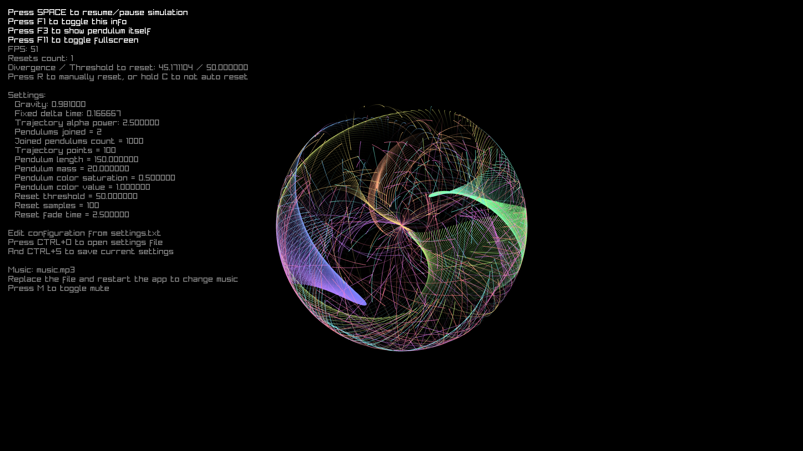

# My Projects History <!-- omit from toc -->

This repository contains **all of my past projects**, whether they are finished or not, all to finally be showcased in public.

Back in the days, I was an *ambitious little programmer* (just as ambitious as I am today, nothing changed 💀), and I have started a lot of projects. Most of them are either **completed, abandoned or served as experiments**. That doesn't mean they were total failure.

I cannot recall every single projects I worked in, nor can I know the exact time of the start/finish of all of them. I will be doing my best to list them all here, along with their specialities they had or what I got to learn from each of them.

This repository serves as a **journey** of my programming arc, from the very beginning to the present day. It is written as a self-aware, **personal documentary and journal** with a few humors here and there. For skimming readers, a table-of-content is provided.

## Table of Content <!-- omit from toc -->

- [1. Early Days Backstory - Pre 2022.](#1-early-days-backstory---pre-2022)
- [2. Wrenchers - Work in Progress - January 6, 2022](#2-wrenchers---work-in-progress---january-6-2022)
  - [2.1. Save File Manager - January 6, 2022](#21-save-file-manager---january-6-2022)
  - [2.2. GamerZ-BPLE - April 29, 2022](#22-gamerz-bple---april-29-2022)
  - [2.3. BPLE++ - April 28, 2024](#23-bple---april-28-2024)
  - [2.4. BPLE++ Test - January 19, 2024](#24-bple-test---january-19-2024)
  - [2.5. Plons Library - October 29, 2024](#25-plons-library---october-29-2024)
  - [2.6. BPP - October 13, 2024](#26-bpp---october-13-2024)
- [3. JetCalculator - Finished - February 5, 2022.](#3-jetcalculator---finished---february-5-2022)
- [4. Minesweeper - Finished - April 21, 2022.](#4-minesweeper---finished---april-21-2022)
- [5. Snake - Finished - May 11, 2022.](#5-snake---finished---may-11-2022)
- [6. Crystal GUI - Work In Progress - September 25, 2022 to Now](#6-crystal-gui---work-in-progress---september-25-2022-to-now)
  - [6.1. Revision 1 - September 25, 2022.](#61-revision-1---september-25-2022)
  - [6.2. Revision 2 - March 23, 2023.](#62-revision-2---march-23-2023)
  - [6.3. Revision 3 - July 11, 2025.](#63-revision-3---july-11-2025)
  - [6.4. Revision 4?](#64-revision-4)
- [7. Game of Life - Finished - June 28, 2023.](#7-game-of-life---finished---june-28-2023)
- [8. Alcelin - Abandoned - May 30, 2024](#8-alcelin---abandoned---may-30-2024)
  - [8.1. aplib.hpp - May 30, 2024](#81-aplibhpp---may-30-2024)
  - [8.2. Auspicious Library - July 3, 2024](#82-auspicious-library---july-3-2024)
  - [8.3. Alce Library - October 28, 2024](#83-alce-library---october-28-2024)
  - [8.4. Alcelin - January 7, 2025](#84-alcelin---january-7-2025)
- [9. GCC Bug Report - Finished - January 28, 2025.](#9-gcc-bug-report---finished---january-28-2025)
- [10. Zorther - Abandoned - December 13, 2024](#10-zorther---abandoned---december-13-2024)
- [11. Hypnotizing Double Pendulum - Finished - January 5, 2025.](#11-hypnotizing-double-pendulum---finished---january-5-2025)
- [12. Cyrine - Work in Progress - January 10, 2025](#12-cyrine---work-in-progress---january-10-2025)
- [13. Mission Clean raylib Examples - Finished - January 15, 2025.](#13-mission-clean-raylib-examples---finished---january-15-2025)
- [14. Illusnake - Finished - January 21, 2025.](#14-illusnake---finished---january-21-2025)
- [15. Rounded Rectangle Shader Example - Finished - January 22, 2025](#15-rounded-rectangle-shader-example---finished---january-22-2025)
- [16. Minesweeper - Abaondoned - February 20, 2025](#16-minesweeper---abaondoned---february-20-2025)
- [17. Fluxins - Finished - June 17, 2025](#17-fluxins---finished---june-17-2025)
- [18. Optrone - Finished - June 18, 2025](#18-optrone---finished---june-18-2025)
- [19. Rust Game of Life - Finished - September 9, 2025](#19-rust-game-of-life---finished---september-9-2025)
- [20. RLMS - Finished - September 21, 2025](#20-rlms---finished---september-21-2025)
- [21. Notable Mentions](#21-notable-mentions)
- [22. Things I Touched](#22-things-i-touched)
- [23. The Future](#23-the-future)

## Projects List <!-- omit from toc -->

### 1. Early Days Backstory - Pre 2022.

The year is 2021, and COVID-19 just struck my country. 16 year old me went to my native village, and I got trapped. I can no longer travel back to home due to lockdown restrictions. Figuring ways to pass my time, I decided to try make my own game. I did not have a computer at that time, so I had to resort to my Mom's mobile phone. I used an Android app (whose name I cannot remember anymore), and built a small game. Just a really tiny shooter game.

Unfortunately, the mobile phone overheated and died permanently. So I had to use my old **Samsung Galaxy Tab 2** (SM-T231 if you are curious). It was running Android 4.4.2, and had 8 GB storage + 1.4 GB RAM. Though, I had a SD Card of 32 GB storage.

My tab did not support that app I was using, so that is when I gotten into programming. I discovered Unity, and the fact that it uses C# for scripting. I decided to learn C# in my tab, so I can start making game after I get back to home and have a computer (it will be a long while even after coming home). This means, **C#... is my first programming language...** whether I like it or not.

I used an Android app **C# Shell** and started learning C# from Brackey's [HOW TO PROGRAM in C#](https://www.youtube.com/playlist?list=PLPV2KyIb3jR4CtEelGPsmPzlvP7ISPYzR) video tutorials. I followed the tutorial and made my own programs in C# Shell.

I made a ASCII Rectangle Generator in C#, though 16 year old me called it "Cube"... It had an input for width (I called it "Length" for unexplainable reason) and height, and render an ASCII rectangle using `+`, `-`, `|` and `#` characters.

```
Length :12
Height :6
=========
+----------+
|##########|
|##########|
|##########|
|##########|
+----------+
=========
```

It didn't have the best code for it, but it was mine. And I was proud.

But there was a problem: **C# Shell was too slow** on my tab. It is to be expected, but it was slow than any other apps. It would take a whole 10 seconds just to compile and run the program. And even in execution, it would display output slowly.

I googled some phrase like "*fastest programming language*", and found a Microsoft website (or at least I think it as Microsoft, I could be totally wrong too) that compared runtime performance of a bunch of different programming language. C and C++ were ranked highest. C++ particularly grabbed my attention, as it was the second fastest listed, but far more features mentioned than C. That is when I **switched my language to C++**. That was the only factor for language consideration, what else can be done on an old tab?

I found a different Android app **CPP-N-IDE**, which had a version that supported Android 4.4. I believe it used GCC 4 or some other dated toolchain like that (or was it 8 probably?), and it did not had a debugger (I believe...) or other tools that a modern IDE would have. It did have a formatter though.

*Shh: I also modded CPP-N-IDE. It had the option to theme the editor, and the default was Light Theme. I wanted dark, but theming option is only available for premium users. So I dug up its APK, tinkered with its default settings, and boom: Dark Theme by default 😎.*

I started writing C++ code. Googling my ways through, read some random tutorials, etc. And eventually recreated the rectange program in C++. I was shocked on just how much faster it ran. Almost no delay on the grumpy old tab. I wrote many C++ programs in it, and almost all of them helped me learn C++ more and more.

I wrote almost all my programs based on my own needs. No "To-Do List", no "Guess The Number", no "Quiz Game". I wrote only what I was interested in. From a mini calculator using a specific formula, exponent calculator, and *8 different variants* of password generator 😅.

Some of the programs were small and one-off logic that I could have absolutely used a regular calculator. Some of them were giant `main` function that nobody can decipher. But exponent calculator is where I remember having to wait 40 or 50 minutes to calculate `2^65536` or some stupidly large number like that. I don't know how I possibly had the patience to wait that long. But hey, most of them worked!

I retain some of the old programs in my old folders list. The oldest one is dated November 1, 2021 (I started programming a bit while before this date). Seeing back at those programs really is nostalgic. And it really does feel like I preserved a time-capsule, though with wreckage.

It goes without saying, writing giant programs in CPP-N-IDE is **painfully slow**. Even the editor and compiler would start lagging. Could you imagine writing programs on an old tab, with only on-screen keyboard, on an editor that has GCC 4/8 on it, without debugger, where each press would take sometimes a second to appear on the editor, and you are 16 years old?

It really does feel like a **Hardcore Bootcamp** compared to the luxury that any computer, even old ones, can achieve. What kept me going was my sheer desire to build something. I was almost addicted to programming (I still am), even if I didn't realize at that time that those constraints are absurd. I just didn't knew the luxury existed.

Now, moving on from the early history, the following sections are some of my actual "projects" I have written over the years, not just one-off programs.

### 2. Wrenchers - Work in Progress - January 6, 2022

Wranchers is also an arc by itself, and at some point, connects as partner to Alce Library. It is minimal port of Bad Piggies Mod Leading Edge and tools around it.

#### 2.1. Save File Manager - January 6, 2022

Save File Manager is my early programming days project to manipulate Bad Piggies Mod Leading Edge's contraption file which contains the creation data in CSV format. It was developed on my Samsung Galaxy Tab 4, and later using my Dad's laptop. I was still learning classes, so there isn't much to say about it.

[**View Source**](wrenchers/sfmanager)

**What I learnt?** I was still learning programming, so programming I guess?

#### 2.2. GamerZ-BPLE - April 29, 2022

GamerZ-BPLE was a full-on editor compared to Save File Manager. Somehow, it had clean API compared to later projects at that time (probably a fluke, mostly because it is so small compared to others, and no implementation lol).

I switched from VS Code to Visual Studio 2019 in my Dad's laptop (it took AGES to download with my limited internet bandwidth and speed at that time).

Oh, before I forget, GamerZ is just my old online alias name (before my current alias Anstro Pleuton).

[**View Source**](wrenchers/GamerZ-BPLE)

**What I learnt?** I bricked my Dad's laptop, but I got to learn how to use header files (at least, one header file).

#### 2.3. BPLE++ - April 28, 2024

BPLE++ was now a full-on port, aiming to implement Unity-style physics in the reimplementation. It had like 4 revisions before giving up (too ambitious at the time).

I used the PhysX Physics Engine for this, and before giving up, I had basic physics working.

[**View Source**](wrenchers/bplepp)

**What I learnt?** I learnt to use PhysX engine alongside raylib. Kinda.

#### 2.4. BPLE++ Test - January 19, 2024

This time, I went in *knowing* I won't finish. Instead, I developed 3 revisions of BPLE++ as R&D. All involving PhysX and raylib.

[**View Source**](wrenchers/test_bplepp)

**What I learnt?** More PhysX and raylib development.

#### 2.5. Plons Library - October 29, 2024

I created this library, which lived alongside Alce Library, to serve just like Alce Library but with dependencies (Alce Library was independent). This library is a collectino of utils to be used with frameworks, iirc with raylib and PhysX (part of it is from aplib.hpp). It had wrappers for wrapping both raylib and PhysX, but I don't remember more details other than that.

The sources are lost to time.

**What I learnt?** Same as Alce Library and Alcelin.

#### 2.6. BPP - October 13, 2024

This was also a minimal port and actually went far this time, implementing proper part type system, editor and physics with proper joint calculation. This was abandoned due to shift in focus.

**What I learnt?** More PhysX before the focus shifted.

### 3. JetCalculator - Finished - February 5, 2022.

***FIRST EVER PROJECT WRITTEN***. Marks the beginning of my programming journey.

This project is a TUI calculator for a mod of Bad Piggies - [Bad Piggies Mod Leading Edge](https://discord.gg/JYrbsXX) (note: not my game).

The game has Jet Engine, which generates thrust using connected Fuel Tanks. The Fuel Tanks are drained over time, and they are also automatically and simultaneously refueled over time using the available Electric Engines.

This program, given the number of Jet Engines, Fuel Tanks and Electric Engines, calculates how long will the Jet Engine run, or whether it will never run out of fuel based on the configuratino.

[**View Source**](JetCalculator)


**What I learnt?** Programming. duh...

### 4. Minesweeper - Finished - April 21, 2022.

My first ever "game" in raylib. ***HORRIBLE*** codebase, because I was starting new to programming.

Back then I was using Windows 7 in 2022, because I just did not have a good enough computer, so I used my Dad's laptop. I was new to C++.

I used raygui to allow configuring the board size and number of mines, also the size of the individal cells, even spacing because why not. Oh, and, let's not forget offset. It has a working (I guess?) time counter, and a working display of number of mines discovered. Rigorous testing might find it is buggy, so don't test its limits.

[**View Source**](Minesweeper)


**What I learnt?** Making programs that machines can understand: Easy. Making programs that humans can understand: Impossible.

### 5. Snake - Finished - May 11, 2022.

My second ever game in raylib. Much better codebase, though, almost all line has a comment explaining that line xD.

It uses Roboto font, and random generator to generate apple (I hope it does check to not generate apple inside the snake). It draws alternating shades of green for snake, with pure green for the head. It draws grid, and allows wrapping around the grid borders.

[**View Source**](Snake)


**What I learnt?** Why explain your code when your code explains itself?

*P.S: 3 months later, this guy will go on to become a Linux Fanboy. He will also nuke windows installation 2 months after that.*

### 6. Crystal GUI - Work In Progress - September 25, 2022 to Now

This probably deserves an entire section, as it is not just a project but an entire arc. Crystal GUI is a GUI framework that I wanted to create for raylib since 2022. This framework has a long history of revisits and rewrites. This section will be split into multiple revisions. Even though I call them revision, past me did not think it that way, and instead just presented them as brand new, without counting previous attempts as versions.

#### 6.1. Revision 1 - September 25, 2022.

I started the GUI framework as a way to create a GUI window inside a raylib window, then added ability to drag and resize. Slowly, I started building teeny tiny foundation for it.

This became the first revision.


But, I was not experienced enough with framework design. Well, I didn't even know how to work with multiple source files back then. This lead to first abandonment.

This revision had: Windows, with minimize, maximize and close button, along with dragging and resizing functionality. It is drawn using `DrawRectangleRounded`, and then a shader is used to draw shadows. It had a tranparent background, and had Dark/Light variations (the color scheme stolen straight out of Discord).

**What I learnt?** C++ is a really great tool... if you know what you are doing. It is easy to get the design drastically wrong if you are new to C++.

#### 6.2. Revision 2 - March 23, 2023.

This time I decided to use C instead of C++. This is also where the C arc of my programming journey begin. For half a year I used C instead of comfortably using C++.

That revision had a few cool features:
3. Button
4. Drop down
5. Checkbox
6. Toggle
7. Backdrop blur for all elements
8. Animations for all elements


This revision was abandoned not because the code was messy (it was), but because this was when I decided to switch editors. I really didn't like how VS Code (the editor I use to this day) was slow and bloated (skill issue on my part), so I decided to switch to Eclipse... Then I switched to Code::Blocks. Then I tried ricing that... Then I eventually gave up and came back to VS Code. By that time I had forgotten my own codebase and didn't know what I was doing.

**What I learnt?** Switching environment is a much larger deal than it seems. You get too used to your first editor, so make it the best choice from the start. I still can't really come to NeoVim without spending a month or two, which I probably can't spend anyway. And let's be honest: even if I didn't switch up the environment, I would have abandoned this as well...

#### 6.3. Revision 3 - July 11, 2025.

That's a LONG gap between the previous revision. What happened? You should probably see the other sections before returning to this revision...

This is the modern revision, and I used C again (spoiler: this caused abaondonment). I wrote a whole blown API and actually write many parts of the GUI framework, including:

1. Node Scene Graph - Contains node properties such as name, type, user data, transformation, hierarchy, update/draw callbacks, event handler, etc.
2. Transformation - Contains position, size, reativity settings, anchor and padding support. Including helpers to create transformation such as top-left padded, bottom-docked, centered, filled, etc.
3. Node Management - Contains node creation, update, iteration, template/instanciation, and deletion. Custom nodes can be created for any use case, including shader/scissor nodes.
4. Layout Management - Contains direction, alignment and justification, and layout types such as clamp layout (clamp in parent and aspect ratio) linear layout (linearly arrange items in row or column with spacing) and grid layout (arrange items in a grid with row/column index and row/column span).
5. Elementary Nodes - Contains text rendering node, texture rendering node and rounded rectangle rendering node (with support for shadows and boarders).
6. Transition Animation - Contains transition features, easing functions, chained animation, etc.
7. Component Nodes - Contains layer (container), label, button and toggle.
8. Fully Customizable Theming Support - Contains a billion different variables to create a variation of default theme: Crystalline Theme. But also allows creation of a fully custom theme, far more customizable than what even Crystalline offers.

I... stopped... It was too much for C to handle all that. Especially when I explictly tried to avoid heavy use of macros, even then I did use macros to make life less misrable.

[**View Source**](https://github.com/anstropleuton/crystalgui)


**What I learnt?** Sometimes, C is really really NOT the right tool for the job. It is a universal language, and you can absolutely build anything off of just C alone, but it is a very limiting one, and it being universal doesn't imply whether you should do everything in C.

#### 6.4. Revision 4?

Am I going to create a revision 4? Why yes of course! I have to fulfill my obsession towards GUI frameworks :p

But I am renaming it to **Glarens** to avoid confusing users that it is somehow related to [Crystal (programming language)](https://crystal-lang.org). I plan to use C++ (or even Rust to catch up to modern society) rather than C. And I think this time I will use [SDL](https://libsdl.org), [BGFX](github.com/bkaradzic/bgfx), [miniaudio](https://github.com/mackron/miniaudio), and last but certainly not least, [GLM](https://github.com/g-truc/glm).

I have the blueprint and capacability now, and only thing I require is time. Lots and lots of time. And patience of course. I have design ideas and clear feature set to support in mind. Whether I will use C++ or Rust is to be decided based on a coin flip (aka. research).

### 7. Game of Life - Finished - June 28, 2023.

Not my third game, but a game I remade using, once again, raylib. It has customizable step size (to fast forward or slow down the game), grid size, and a GUI using raygui. It also had a fade-effect for each frame.

[**View Source**](anstro_game_of_life_remake)


### 8. Alcelin - Abandoned - May 30, 2024

Alcelin has a HUGE list of renames. It's arc is kind of like Crystal GUI's. All are collection of utils for my programs.

#### 8.1. aplib.hpp - May 30, 2024

It started off as **aplib.hpp** as a list of random collection of utilities for my programs back in 2024. It had operators for concatentaing two vectors, operator for repeating elements of vector, string functions to split strings and word-wrap, ANSI Escape Code constants (like `const red = "\033[31m"`), argument parser mini library, and raylib utilities. 

**It was the beginning of library arc.**

[**View Source**](alcelin/aplib)

Note: Argument parser was taken from older C code of mine from my C arc, but that source is lost to time.

**What I learnt?** Separation of concern is really important, and a library doing too many things that isn't even related to the library itself is bad.

#### 8.2. Auspicious Library - July 3, 2024

Then, it got renamed to **Auspicious Library**. It had much better structure and goals as utility library. It did not have raylib utility though, as it was out of scope for it. It had the same set as aplib.hpp organized and polished, and extras like trim string, lower/upper string conversion, expanded ANSI Escape Code functionality set, and improved argument parser.

It had doc comment for every function, which I did after reading Discord++ (DPP)'s source code. I regret that...

This was also where I was learning CMake and wrote my custom testing framework (obsolete compared to my new favorate doctest). I was learning packaging and creation of an actual library that others can use.

Source code is lost to time.

**What I learnt?** CMake and packaging.

#### 8.3. Alce Library - October 28, 2024

It got rename again, to Alce Library to keep it consistent with my naming scheme: Random made-up words.

#### 8.4. Alcelin - January 7, 2025

It got, you guessed it, renamed, again. To now Alcelin. It splitted testing framework onto Confer (later renamed to Canfirpion and then betrayed for doctest), and it splitted argument parser into Optrone.

It was finally abandoned due to lack of need.

**What I learnt?** Creating a library for sake of creating a library does not work. You need a clear requirement and use case for a project to exist.

### 9. GCC Bug Report - Finished - January 28, 2025.

I stumbled upon a bug in GCC while working on one of my project. It was a Regression (crashing the compiler), happened as a result of combination of templates, default template arguments and deduction guides inherited from a type.

Basically inheriting from `std::span` and adding deduction guide to deduce from `std::ranges::contiguous_range`, and having it deduce the template parameters from `std::vector` caused the compiler to crash.

I submitted a bug report to [Arch Linux's GCC package distribution](https://gitlab.archlinux.org/archlinux/packaging/packages/gcc/-/issues/15) on September 25, 2024. I was informed that this bug is an issue of upstream, and I submitted a bug report to [GCC](https://gcc.gnu.org/bugzilla/show_bug.cgi?id=117855) on November 11, 2024. It is finally fixed on January 28, 2025.


**What I learnt?** I experienced the bug report process, from isolating the issue, to writing formal report, submitting to the projects (from distro to mainstream), following bug report guidelines and finally sitting back, knowing you left your mark.

### 10. Zorther - Abandoned - December 13, 2024

Zorther is a story I wrote, where I combined my storytelling with ChatGPT for text generation. It had an interesting plot, character development, world building, dialogues (by ChatGPT), etc. One that I would absolutely love to tell.

It was my first website that I made and hosted in GitHub.

I abandoned it as I learnt that ChatGPT has a limit in how much it can remember from the conversation. I can absolutely rewrite the entire thing where everything is from me directly, if I get time that is.

[**View Sources**](https://anstropleuton.github.io/zorther)

**What I learnt?** I reinforced my web development knowledge (bare minimum) and did some storytelling.

### 11. Hypnotizing Double Pendulum - Finished - January 5, 2025.

A mini project to get me back into raylib. I stumbled across a video about [AI learning to balance double pendulum](https://youtu.be/9gQQAO4I1Ck) by Pizzza's Work and I wanted to recreate the visuals shown in the video.

This turned out really simple to do, and I was able to make to get myself back into raylib after this.

The visuals are created by simulating 1000 double pendulums, and recording the trail of ends of each of the pendulums. Each trails have an assigned color from hue 0 to 360, for each pendulum with slight initial condition differing. All the pendulums start looking exactly the same, but they slowly start drifting away from each other and creates a cool color wave effects.

[**View Source**](https://github.com/anstropleuton/hypnotizing_double_pendulum)



**What I learnt?** Real world physics simulation sometimes does not need an engine. Few like these are just purely mathematical and algorithmic.

### 12. Cyrine - Work in Progress - January 10, 2025

A super-simple command line password manager using Optrone. It was named Cifrus earlier and later got renamed. I even plan to use it for my defacto password manager once I get around to finishing it.

### 13. Mission Clean raylib Examples - Finished - January 15, 2025.

raylib exampels folders required cleanup and maintainance. There were several inconsistencies in the example files and the index in the examples/Readme.md that lists the examples. Inconsistencies, like the file listing its difficulty rating as 2/4 stars, while the index listing them as 3/4 stars, or the example file has different author mentioned.

I created a few Python scripts to document all the inconsistencies, and then guide me to fix them all. These scripts would read all the example files, read the index, and read the examples from the raylib.com website. It would then compare all the information and provide a list of inconsistencies.

Later, I created a [pull request](https://github.com/raysan5/raylib/pull/4711) that fixes all the issues, and it got merged.

[**View Sources**](mission_cleanup_raylib)

**What I learnt?** I learnt scripting with Python and how Data Processing works, including data mining, data analysis and report generation.

### 14. Illusnake - Finished - January 21, 2025.

A snake game with tiles, snake and apple replaced with shifting pattern of white, gray and black colored tiles (with different offset for tile, snake and apple), to make it difficult to see the snake or the apple. It also occasionally shows the body of the snake and the apple to guide the player, though this might be unnecessary since it is not too difficult to spot the snake or the apple.

[**View Source**](https://github.com/anstropleuton/illusnake)


**What I learnt?** Nothing new...

### 15. Rounded Rectangle Shader Example - Finished - January 22, 2025

An example for raylib illustrating creation and rendering of a rounded rectangle with shadows and borders. This is useful for creating modern and polished GUI element.

It got [merged](https://github.com/raysan5/raylib/pull/4719) with raylib!

[**View Source**](https://github.com/raysan5/raylib/blob/master/examples/shaders/shaders_rounded_rectangle.c)


**What I learnt?** Contributing to Open Source projects is actually much easier than you think!

### 16. Minesweeper - Abaondoned - February 20, 2025

The birth place for [RLMS](#10-rlms---finished---september-21-2025)'s minesweeper implementation, and [Fluxins](#12-fluxins---finished---june-17-2025)'s expression parser core. This project was meant to be my second implementation for Minesweeper. It had a robust (probably) of minesweeper's core logic compared to my [first Minesweeper](#3-minesweeper---finished---april-21-2022).

It also had **Minui**, which was a way for me to experiment with Hierarchal GUI node system for designing GUI framework (inspiration for [Crystal GUI's Revision 3](#3-revision-3---july-11-2025)). I named node "Layout" for unexplainable reason... It supported stack box, column, row, grid and interactable "layouts".

[**View Sources**](minesweeper_2)

I abandoned it because I realized the potential of Minui, and I really wanted to make a GUI framework first, even though I could have absolutely shipped it (I later did with RLMS).

**What I learnt?** Projects sometimes die by envisioning frameworks and modularization, instead of shipping. This one was worth it though, it allowed Crystal GUI Revision 3 and made me do something much larger than just Minesweeper.

### 17. Fluxins - Finished - June 17, 2025

An expression parser written in C++23 and no dependencies. It supports many operators, prefix, suffix and infix, and also declaring variables and custom functions. It used Pratt-Parser technique to parse the expression.

It started off as a module for [Minui](#11-minesweeper---abaondoned---february-20-2025) to parse expression, which was used for nodes calculation and allowing users to define custom rules for shaping the nodes. It was inspired by CSS's `calc` but think of it as native and first-class support for GUI node system rather than an afterthought.

Now it is completely independent, and has no relation with GUI other than that use cases, as it can be used anywhere where numbers can be used, such as text field where user can enter `1 + 1` and expect it to resolve automatically.

It has a roadmap of small refactor ideas, though I never gotten around to execute them. It includes a REPL program as well.

[**View Souorce**](https://github.com/anstropleuton/fluxins)


**What I learnt?** Refactor requirements can kill a hobby project if it is too large. You should take them in small steps.

### 18. Optrone - Finished - June 18, 2025

Optrone started as an unnamed C project during my C arc to parse command line arguments. It later got merged in [aplib.hpp](#151-aplibhpp---may-30-2024), then carried through [Auspicious Library](#152-auspicious-library---july-3-2024), and finally split up into a standalone library.

It has a nice set of features for parsing command line arguments, supporting both POSIX-style arguments (`-o`, `--option`) and Microsoft-style arguments (`/S`, `/SWITCH`). It also supports parameters (with variadicity and default) and subcommands (positional arguments), all packed in a usable API.

It has a roadmap of small refactors, just like [Fluxins](#14-fluxins---finished---june-17-2025).

[**View Source**](https://github.com/anstropleuton/optrone)

**What I learnt?** Same as Fluxins.

### 19. Rust Game of Life - Finished - September 9, 2025

I created yet another Game of Life in C++, then created a direct port of it to Rust to see what it's like. I'd say, Rust is good. I don't need rust as I need C++, but I am sure I will use Rust in future projects sometimes to learn even more. What I did is only scratching the surface.

[**View Source**](rust_game_of_life)

**What I learnt?** Rust is good 👍👍.

### 20. RLMS - Finished - September 21, 2025

Minesweeper, again. This version has a few cool features compared to first time I made minesweeper.
1. Logically Solvable\*: Board requires no guesses to solve.
2. Speed reveal: Trying to reveal a revealed cell with the number of neighboring mines equal the number of hidden, unmarked adjacent cell, will reveal all those adjacent cells.
3. Speed flag: Trying to flag a revealed cell with the number of neighboring mines equal the number of hidden, unmarked adjacent cell, will flag all those adjacent cells.
4. Dark theme.

\*: This is possible if and only if the board configuration allows logically solvable puzzles. It uses 100 attempts to generate a logically solvable board before giving up. The more mines there is, the less likely it is to be logically solvable.

I already had a [robust implementation](#11-minesweeper---abaondoned---february-20-2025) of Minesweeper from February 4, 2025. But I really wanted to make a GUI framework before minesweeper. On September 19, 2025, I decided to use the implementation and make minesweeper, even I did not have a GUI framework. Ended up doing in 2 days. Can you imagine how much longer it would  take if I really insisted in making a GUI framework first?

It does not have a framework. Ok I lied, it has a small library baked in it to manage things. But most of the GUI calculation is just done manually by using whole bunch of Rectangle variables instaed of a layout system.

[**View Source**](https://github.com/anstropleuton/rlms)


**What I learnt?** Sometimes, you gotta take shortcuts to make sure you ship your product, and control your urge to build a framework for one tiny thing.

### 21. Notable Mentions

1. **Web Development** (March 5, 2024)
    I started creating a desktop simulator for my Xiorite OS. I used MDN to learn Web Development using plain old HTML, CSS and JS.
    I quickly learnt that Web Dev is not for me as I grew to hate CSS (anyone relates? no? just me?). I later abandoned Web Dev entirely.
    On August 19, I came to use React (Vite + React + TypeScript) to get back in Web Dev, to see the other side. I was shocked how much better it is compared to HTML, CSS and JS. It's still trash, but the gap is insane. Earlier I avoided frameworks because I thought they were too opinionated. I see why they are and why it is better to be so.
    I am using React + Vite + TS (SWC) + Tailwindd CSS + Lucide Icons + etc. etc. as my stack for my portfolio website.
    **What I learnt?** Most people learn frameworks instead of raw HTML/CSS/JS, because is it objectively much saner than using raw.
2. **Tinya** (July 5 2024)
    A discord bot using Discord++ (DPP) I made for helping me in Discord stuff. It was mostly for meme, and it got its own name on December 2, 2024. I lost the source code.
    **What I learnt?** Discord bot development to a minor extent.
3. **LastSmall** (July 13, 2024)
    A drunk-style interpreted programming language made purely as a joke. Even the name suggests: Project does not last long.
    I went full nuts on the codebase, to see what I can do if I never organized the codebase. It was horrible...
    [**View Sources**](lastsmall)
    **What I learnt?** You can't get away with not organizing the codebase.
4. **Turinel** (January 28, 2025)
    A mathematical library to wrap GLM and allow interoperability with Vector types from both raylib and PhysX.
    It was pointless, and I did not do further development to it.
    [**View Source**](turinel)
    **What I learnt?** Pointless projects don't last.
5. **Android Apps** (Unknown Era)
    I tried doing some Android App Development using Kotlin and Jetpack Compose. I completed 3 units from Basics of Jetpack Compose by Google's official courses.
    I even made one or two of my own apps, (notably 30 minecraft facts instead of 30 days aspirations).
    I had to delete all the Android apps I created as everything eventually ate all my storage space. I abandoned Android app development because Jetpack Compose is a real trash. Worse than Web Development, unstable and 90% of useful features locked behind experimental API (even the Docs in that API misleads users and tells them to use API that is now deleted).
    Jetpack Compose, will not work, as soon as you try to step away from Material Theme, even as little as 0.1% deviation from their inferioir vision.
    **What I learnt?** Android App Development is just too opinionated for me.

### 22. Things I Touched

These expand on fields I touched. By "touched" I mean barely used to see what it's like.

1. **GTK Apps** (Unknown Era)
    I touchede GTK Apps Development and Vala. Vala was THE language that got me into designing [Engenide](#21-the-future).
2. **WinUI Apps** (Unknown Era)
    I touched GTK, so why not touch what's Windows has to offer: WinUI 3. So I did. Just like GTK, it too seemed like glorified HTML lol.
3. **Java** (February 7, 2025)
    I touchede Java because my college course had it. Hindsight: I really did not need to. I was already better in Java than everyone without ever using it 😎.

I am probaly missing a whole bunch of other things I touched, but these are what I can immediately recall.

### 23. The Future

Just so you know: none of these is possible, except maybe (just maybe) for Engenide.

1. **Engenide** - A whole programming language with tons of features. I have envisioned a large portion of this language and created a design document that I am constantly updating with more design ideas. This language's driving philosphy is Freedom of Expression, which says *"if it makes sense semantically, it is allowed."* I can absolutely start working on it anytime now, but I will hold on to it until it is the right time.
2. **Xiorite** - A whole operating system. I did make cool Windows-11-styled wallpapers for in Blender, and a Web-based desktop simulator.
3. **Excrasen** - A whole ecosystem of device: Phone, Laptop, Tablet, Desktop, Television and Watch.
4. **Nirovan** - A whole corporation + organization (a dual entity) of my own. Do I become a startup founder and go [Founder Mode](https://www.youtube.com/watch?v=kMLEXpHCCkk)?
